# Architecture

## Overview

This is a fully static educational website — all pages are pre-rendered at build time by Astro and served from Vercel's CDN. There is no server-side compute at runtime. The interactive solver runs entirely in the browser via a Web Worker that hosts a Python runtime (Pyodide/WASM).

---

## System Diagram

```mermaid
graph TB
    subgraph Browser["Browser"]
        subgraph Pages["Astro Pages (SSG — pre-rendered HTML)"]
            P1["/index"]
            P2["/solver"]
            P3["/history"]
            P4["/examples"]
            P5["/lesson"]
            P6["/about"]
        end

        subgraph Islands["Svelte Islands (client-side hydration)"]
            SW["SolverWorkspace\n(client:load)"]
            GP["GlossaryPanel\n(client:only)"]
            EF["ExampleFilter\n(client:load)"]

            subgraph SolverComponents["Solver UI Components"]
                PI["ProblemInput"]
                SC["SolverControls"]
                SP["SolutionPanel"]
                CC["ConvergenceChart"]
                IL["IterationLog"]
            end

            SW --> PI
            SW --> SC
            SW --> SP
            SW --> CC
            SW --> IL
        end

        subgraph Lib["src/lib (shared utilities)"]
            WC["worker-client.ts\nWorkerClient class"]
            PS["problem-schema.ts\nZod validators"]
            UC["url-codec.ts\nURL sharing codec"]
            EX["export.ts\nJSON export"]
        end

        subgraph Worker["Web Worker — solver.worker.ts"]
            PY["Pyodide\n(Python WASM runtime)"]
            DW["dantzig-wolfe-python\n(.whl package)"]
            PY --> DW
        end

        SW -->|uses| WC
        SW -->|uses| UC
        SW -->|uses| EX
        WC -->|"INIT / SOLVE / CANCEL\n(postMessage)"| Worker
        Worker -->|"READY / ITERATION / RESULT\n(postMessage)"| WC
    end

    subgraph StaticAssets["Static Assets (public/)"]
        WHL["dwsolver-0.1.0-py3-none-any.whl"]
        EXJ["examples/*.json\n(pre-built problems)"]
        PL["pyodide-lock.json"]
    end

    subgraph Content["Astro Content Collections (src/content/)"]
        CH["history/*.mdx"]
        CG["glossary/*.yaml"]
        CE["examples/*.mdx"]
        CL["lessons/*.mdx"]
    end

    subgraph External["External"]
        PYCDN["cdn.jsdelivr.net\n(Pyodide runtime JS + stdlib)"]
    end

    subgraph Hosting["Vercel (static hosting)"]
        DIST["dist/ — SSG output"]
    end

    Pages -->|"getCollection() at build time"| Content
    Content --> CG --> GP
    P2 --> SW
    P4 --> EF

    Worker -->|fetch| WHL
    Worker -->|load runtime| PYCDN

    Browser -->|HTTPS| Hosting
```



---

## Key Architectural Decisions

### No server-side compute

All pages are generated at build time (`astro build`). The only runtime network requests are:

- The Pyodide JavaScript runtime loaded from `cdn.jsdelivr.net` (cached after first visit)
- The solver `.whl` wheel served as a static asset from `public/`

### Island architecture

Astro renders each page as static HTML. Interactive components (`SolverWorkspace`, `GlossaryPanel`, `ExampleFilter`) are Svelte 5 islands that hydrate client-side. This keeps the initial page weight minimal — most pages ship zero JavaScript.

### Web Worker isolation

The solver runs in a dedicated Web Worker (`src/workers/solver.worker.ts`). The main thread never blocks on Python execution. The `worker-client.ts` module wraps the entire `postMessage` protocol, mapping outbound requests to inbound responses by `requestId`. The message protocol is documented in [`specs/002-initial-feature-files/contracts/solver-worker-contract.md`](../specs/002-initial-feature-files/contracts/solver-worker-contract.md).

### URL-encoded problem state

The shareable URL codec (`src/lib/sharing/url-codec.ts`) encodes the full `ProblemInstance` into a URL query parameter so users can share specific problems without any server or database. Problems loaded from worked examples set a `sourceExample` metadata field to reconstruct the source link.

### Content collections

All written content (history articles, lesson sections, glossary terms, worked examples) lives as MDX files in `src/content/` and is validated at build time by Zod schemas in `src/content/config.ts`. Components like `Callout`, `Citation`, `MathBlock`, and `TermLink` are available as MDX components throughout.

---

## Worker Message Protocol

```
Main thread                         Web Worker
──────────                          ──────────
INIT ─────────────────────────────► load Pyodide + .whl
                                    ...
                        ◄─────────── READY { pyodideVersion, solverPackageVersion }

SOLVE { requestId, payload } ──────► convert ProblemInstance → Python dict
                                     call dantzig_wolfe.solve()
                        ◄─────────── ITERATION { requestId, payload } (×N)
                        ◄─────────── RESULT { requestId, payload }

CANCEL { requestId } ──────────────► set cancel flag (checked between iterations)
                        ◄─────────── RESULT { status: 'cancelled' }
```

---

## Data Flow: Solver Solve Request

```
User input (ProblemInput)
  → validated by problem-schema.ts (Zod)
  → ProblemInstance
  → worker-client.ts: solve(instance)
  → postMessage SOLVE to Web Worker
  → solver.worker.ts: Python dantzig_wolfe.solve()
    → streams ITERATION messages back per column generation iteration
    → posts final RESULT { status, objectiveValue, primalSolution, iterations, ... }
  → worker-client.ts resolves promise, emits iteration events
  → SolverWorkspace updates reactive state
  → SolutionPanel / ConvergenceChart / IterationLog re-render
```

---

## Directory Reference

| Path                       | Purpose                                                                   |
| -------------------------- | ------------------------------------------------------------------------- |
| `src/pages/`               | Astro route pages (SSG)                                                   |
| `src/components/layout/`   | BaseLayout, NavBar, Footer, GlossaryPanel                                 |
| `src/components/content/`  | MDX prose components (Callout, Citation, MathBlock, TermLink, InlineMath) |
| `src/components/solver/`   | Interactive solver UI (SolverWorkspace and sub-components)                |
| `src/components/examples/` | ExampleCard, ExampleFilter                                                |
| `src/content/`             | Astro content collections (MDX + YAML)                                    |
| `src/lib/solver/`          | worker-client, problem-schema (Zod), export                               |
| `src/lib/sharing/`         | URL codec for shareable problem links                                     |
| `src/lib/math/`            | Matrix/vector utilities                                                   |
| `src/workers/`             | solver.worker.ts (Pyodide Web Worker)                                     |
| `src/styles/`              | global.css — Tailwind v4 `@theme` brand tokens                            |
| `public/`                  | Static assets — .whl solver package, example JSON, pyodide-lock.json      |
| `features/`                | Gherkin acceptance scenarios (authoritative spec)                         |
| `tests/acceptance/`        | Cucumber + Playwright step definitions                                    |
| `tests/unit/`              | Vitest unit tests                                                         |
| `specs/`                   | SpecKit design artefacts (plan, data-model, contracts, tasks)             |
